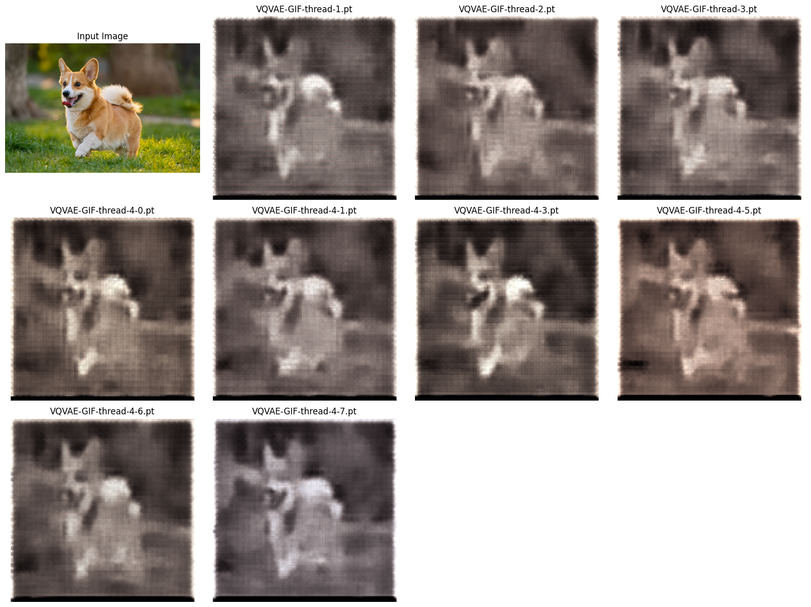
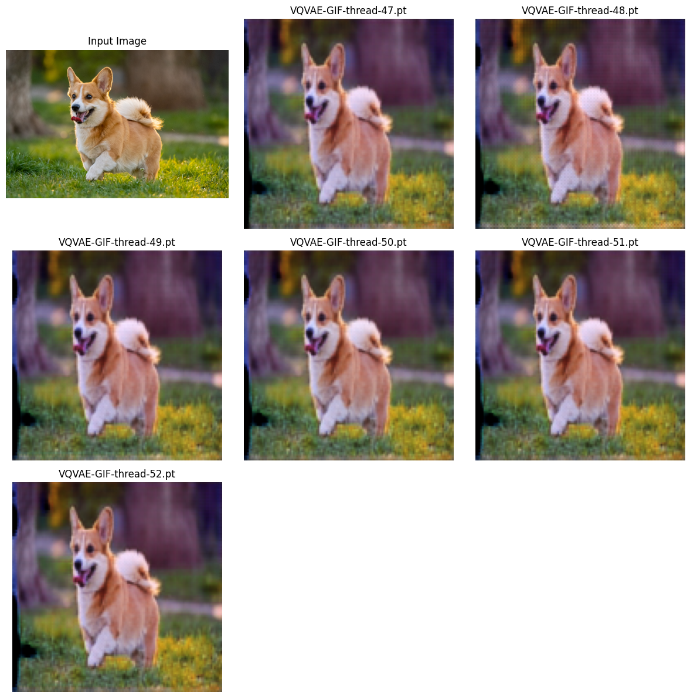
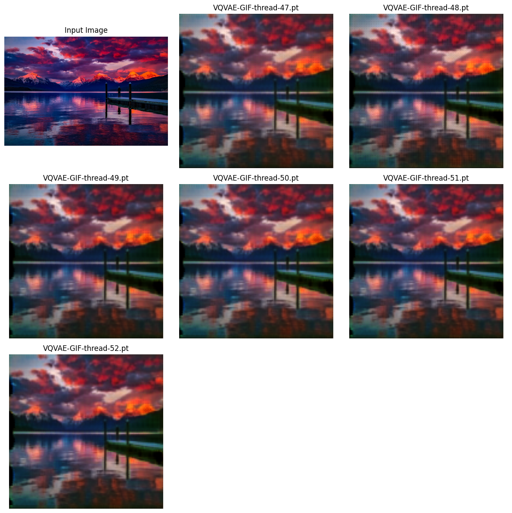
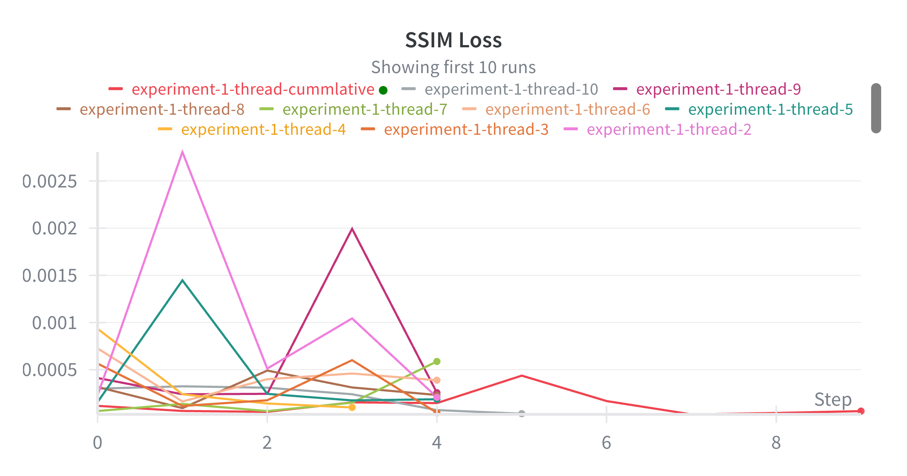
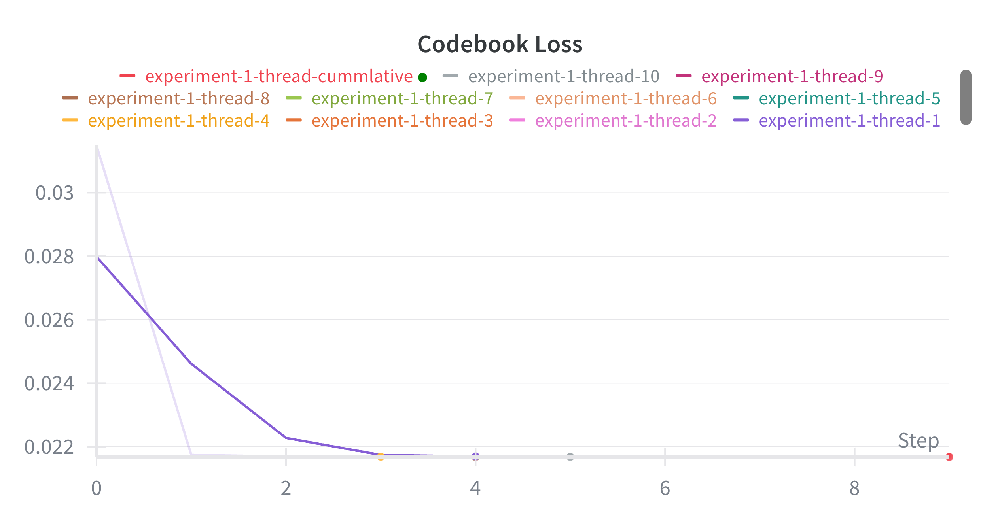
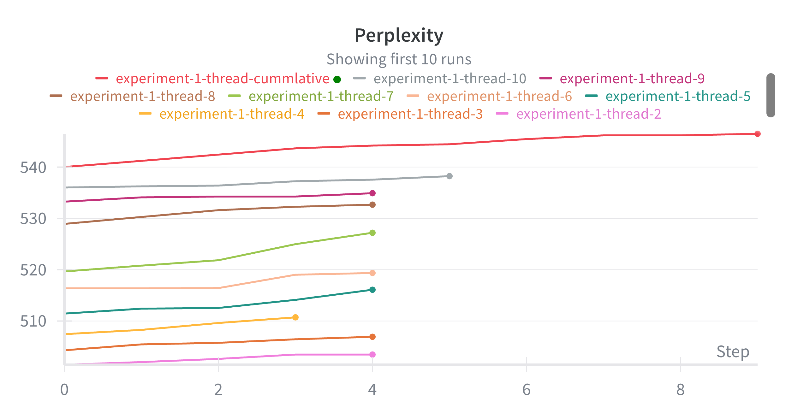
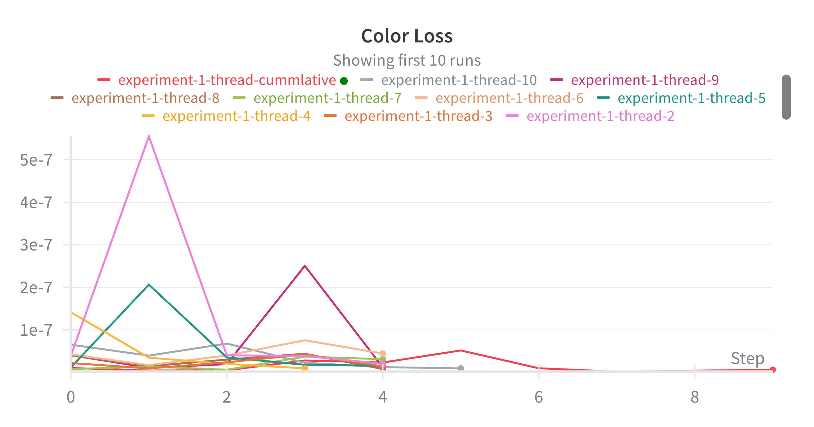
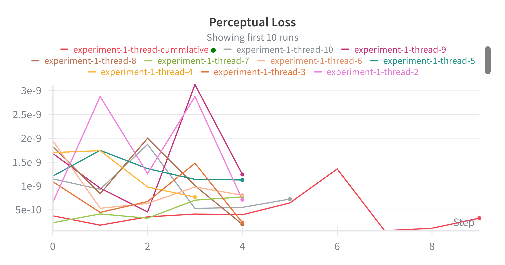
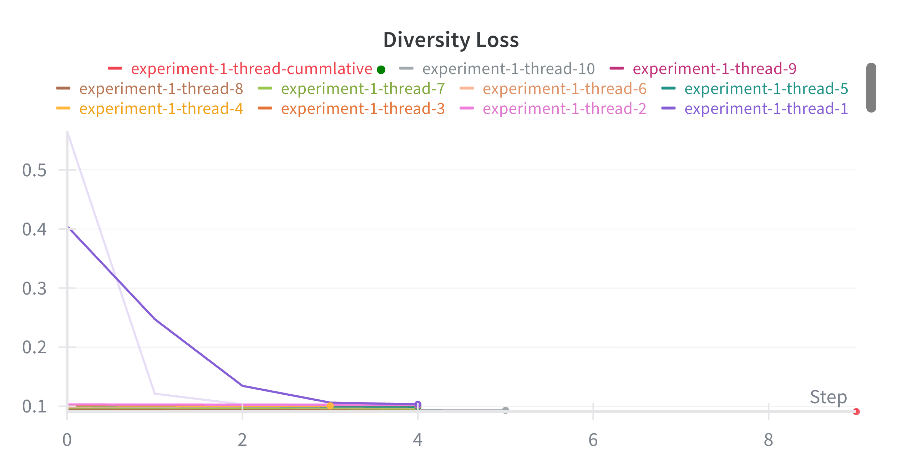

# Text-To-Video-Generation

## Overview

This project focuses on developing a Text-to-Video Generation Model trained on the Tumblr-GIF dataset.

---

## Data Processing

- Due to GPU memory constraints, the dataset is processed in chunks of 10,000 samples.
- All video frames are resized to 128 × 128 pixel Frames.
- Only videos (GIFs) with a frame count between 15 and 40 are included.
- Explicit content filterin* has not yet been implemented. A safety layer for content moderation will be added after the model has been trained.
- The total number of video frames after preprocessing is still being calculated / to be added.

---

## Model Architecture

### Part 1: VQ-VAE Training

Implementation Reference:  [Video-Generation-Flowing-MNIST](https://github.com/Ishushan02/Video-Generation-Flowing-MNIST/blob/main/model-4-VQVAE.ipynb)

#### Initial Observations:
- During the early training stages, the **encoded-decoded frames** appeared in **black and white**, despite colored image inputs.
- Initial Encoded-Decoded Images:  
  
- This issue was resolved by adding two additional loss functions:
  - **Perceptual Loss** (based on a VGG network)
  - **Color Loss** using **LAB color space**:
    - `L`: Lightness  
    - `A`: Green → Red  
    - `B`: Blue → Yellow  
  - These losses helped improve **RGB color prediction** significantly.

#### Color Restoration Comparison:
```
+--------+--------------+---------------------+------------------------------------+
| Input  | Ground Truth | Current Loss Output | current + Color Loss + Perceptual  |
+--------+--------------+---------------------+------------------------------------+
| ![IMG] | 🟩🟥🟦        | 🟩⬜⬜ (washed out)  | 🟩🟥🟦 (true color restored)    |
+--------+--------------+---------------------+------------------------------------+
```
- After Color-Loss Inclusion Encoded-Decoded Images:  
  
---

### Modifications from Base Implementation:
- The VQ-VAE model has been modified from the original reference implementation.
- Residual connections have been added between blocks to prevent gradient vanishing and enhance the model’s ability to learn dynamic features.
- Training was conducted using 10 parallel threads, each for 5 epochs.
- At the end of training, a cumulative training step aggregates features from all threads to avoid catastrophic forgetting.
- Model Specification  
    `(128 channels, 32 × 32 frame size)`
- CodeBook Dimension
    `1024 × 256`  
    `1024`: Number of embeddings  
    `256`: Embedding dimension of the vectorized VAE
- Each Epoch takes about #hrs 45 mins to train
- Final Encoded-Decoded Images:  
  
---

### Training Plots:

<table>
  <tr>
    <td>
      <div align="center">
      <h4>SSIM Loss Over Epochs</h4>
      </div>
      
    </td>
    <td>
      <div align="center">
      <h4>CodeBook Loss Over Epochs</h4>
      </div>
      
    </td>
  </tr>
  <tr>
    <td>
      <div align="center">
      <h4>Codebook Perplexity Over Epochs</h4>
      </div>
      
    </td>
    <td>
      <div align="center">
      <h4>Color Loss Over Epochs</h4>
      </div>
      
    </td>
  </tr>
  <tr>
    <td>
      <div align="center">
      <h4>Perceptual Loss Over Epochs</h4>
      </div>
      
    </td>
    <td>
      <div align="center">
      <h4>Diversity Loss Over Epochs</h4>
      </div>
      
    </td>
  </tr>
</table>

---


Part2 -

In Progress ... 

Train a Auto Regressive Transformer Model combining (positional Embedding, Text Embedding ) -> Giving output an Frame Embedding  throught time space to generate Video Frames..


Text Encoding 
CLIP Based only 77 MAX Tokens as input
Using BERT - 512 MAX .. 
Roberta, GPT all are very much higher..

Model
Added postional embed to text, temporal embed for videos and Encoder in and out
